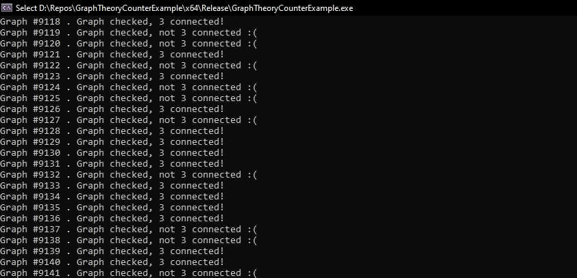

# GraphTheoryCounterExample
## Authors:
[Matthew Pechen-Berg](https://github.com/mattloulou) and [Evan He](https://github.com/evanhyd)

## What is this project?
During my first year of university (Matthew Pechen-Berg), I learned about this conjecture during an honours algebra course from my professor which stuck with me.
It originated from the Danish mathematician C. Thomassen: "For all 3-vertex-connected graphs, every longest cycle must have a chord".

I initially tried many approaches to prove this conjecture true for many months. I lost lots of sleep about it because I kept coming up with ideas while trying to go to bed. However, all my attempts failed.
My friend, whom I told about this project, decided with me to try and look for a counter-example, as only 1 valid counter-example would prove that this half-century long conjecture is false.

This is not as easy as it sounds, as there is no polynomial-time algorithm for finding largest cycles in a simple graph.

We ultimately did not find a conjecture, but we are happy with our try nonetheless. 

## Program Information

The program begins with you inputting the size of the graph you want. As this is still a prototype, instead of using the combinatorial method to generate 3-vertex-connected graphs, we simply made random ones with a specific number of vertices, and then checked if it was 3-connected. If it was, then we tested it for the conjecture. In the output, if it says "Graphed checked", then it means that the conjecture was true for it. The program would print out the graph if it found a counter-example.

For a graph with 13 vertices, it can do about 1000/second.

## Testing
We wrote extensive unit tests to verify the correctness of our program as we developed it. These can be found in "Test Program/test.cpp". It uses **GoogleTest**. We have over 100 total.
